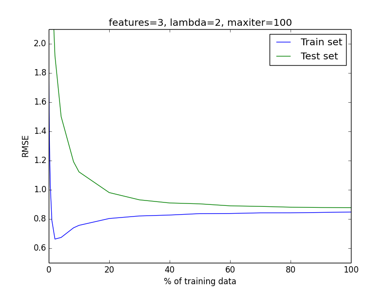
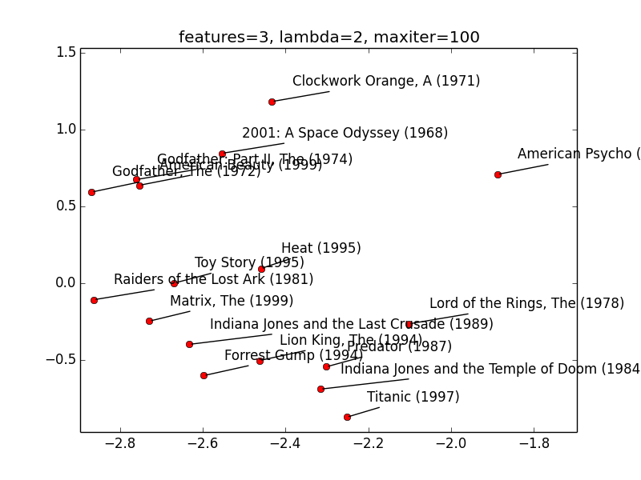
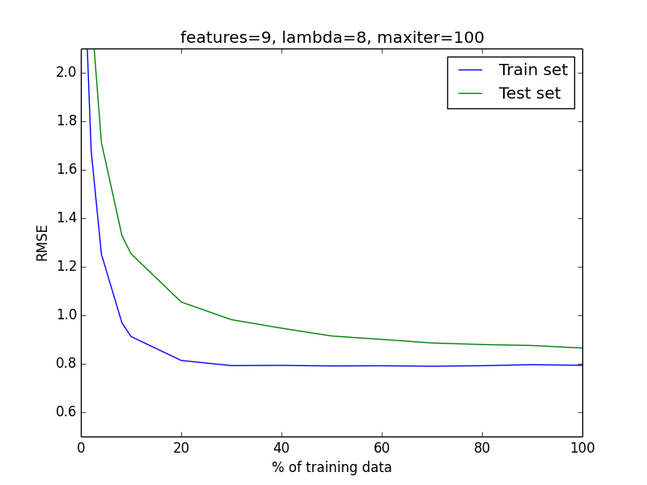
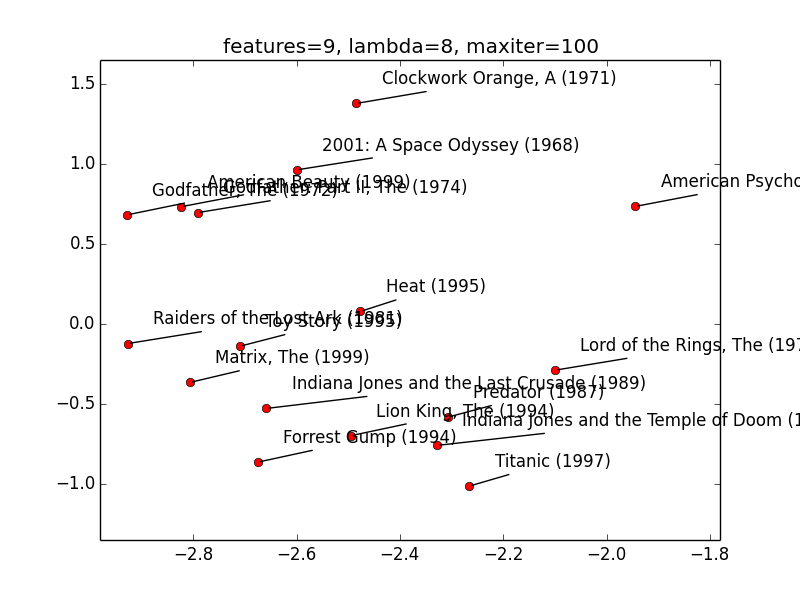

# 3 Features, lambda regularization 2

I was able to achieve RMSE of **0.875** on the cross validation set with 3 features and lambda regularization parameter set to 2. After PCA (dimensionality reduction) to 2D (to visualize data), RMSE increased to 0.888.

Following image shows learning curves of this setting:

Following image visualizes movies in 2 dimensional projection:

# 9 Features, lambda regularization 8

I was able to achieve RMSE of **0.8662** on the cross validation set with 9 features and lambda regularization parameter set to 8. After PCA (dimensionality reduction) to 2D (to visualize data), RMSE increased to 0.909.

Following image shows learning curves of this setting:

Following image visualizes movies in 2 dimensional projection:

