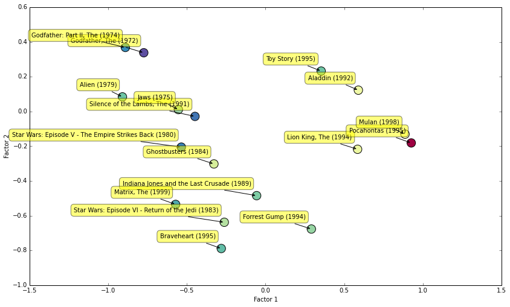

# Project: Movie ratings

You are provided with data about how individual people rate movies.
Your goal is to construct a model that predicts these ratings.

## Files

The ``.csv`` files are used to represent tabular data.
Each line in the file represents a row in the table.
Commas are used to separate individual columns.
The first row is typically the header.

- ``baseline.py`` contains the implementation of a simple baseline model. This model predicts the average rating for each movie.
You can run the program by ``python baseline.py``. 
It also contains some useful functions (loading the data, computing RMSE)
- ``ratings-train.csv`` contains the data for training the model. Each row is a 3-tuple *movie*, *user*, *rating*.
- ``ratings-test.csv`` contains the data for testing how well the model generalizes.
- ``movies.csv`` contains the mapping of movie ids (that is used to represent movies in the ratings-train/test data sets) to their titles and genres.
This file is not required for the training/testing of the model. It will be useful for doing visualizations (like the one at the bottom).

## Metric of success

To infer how well the model generalizes we will use a metric called **Root Mean Squared Error** (RMSE) on the test set.
More information about RMSE can be found on [Wikipedia](http://en.wikipedia.org/wiki/Root-mean-square_deviation). 
``baseline.py`` contains a function that computes RMSE.

## Goals of the project

Baseline model achieves RMSE 0.9790 on the test set.
If you improve the baseline then you should get RMSE around 0.9.
Try to develop a model that achieves RMSE 0.88 or better on the test set.

Try to visualize your model somehow.
For example, if you use a matrix factorization approach with 2 factors then you can visualize selected movies in 2D.
The coordinates of an individual movie are the values of the factors that correspond to that movie.

